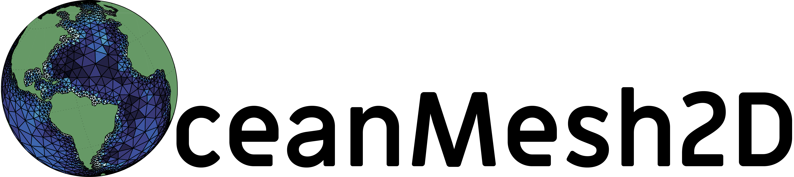
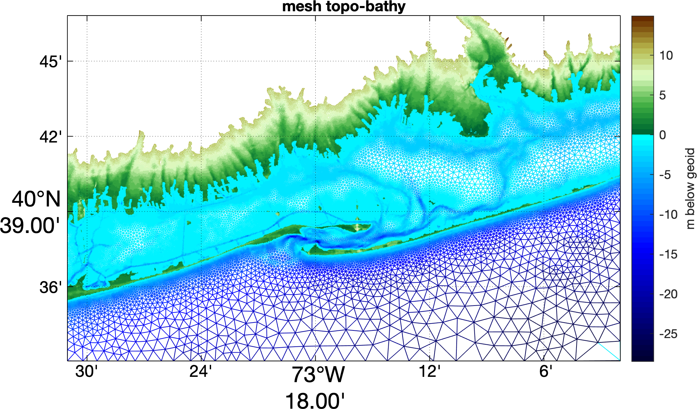
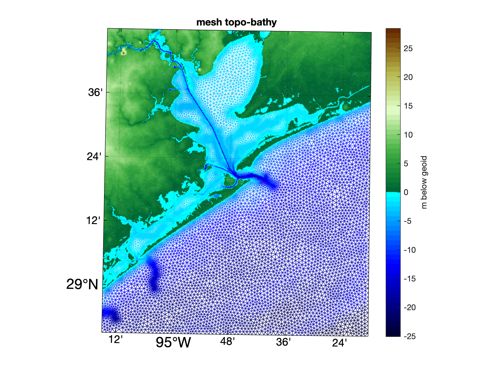
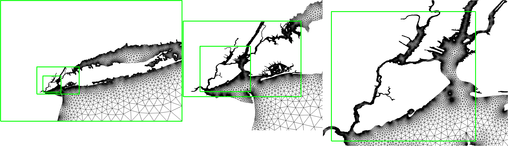
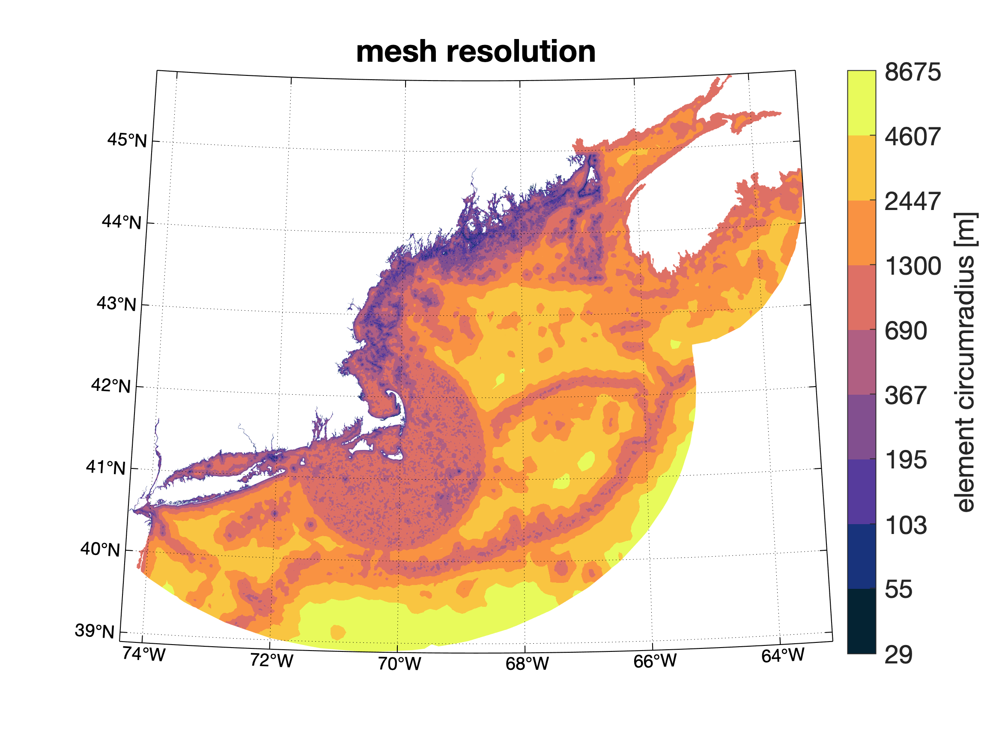
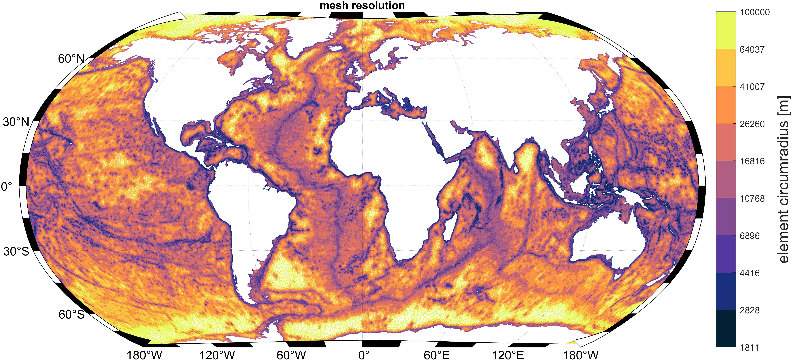
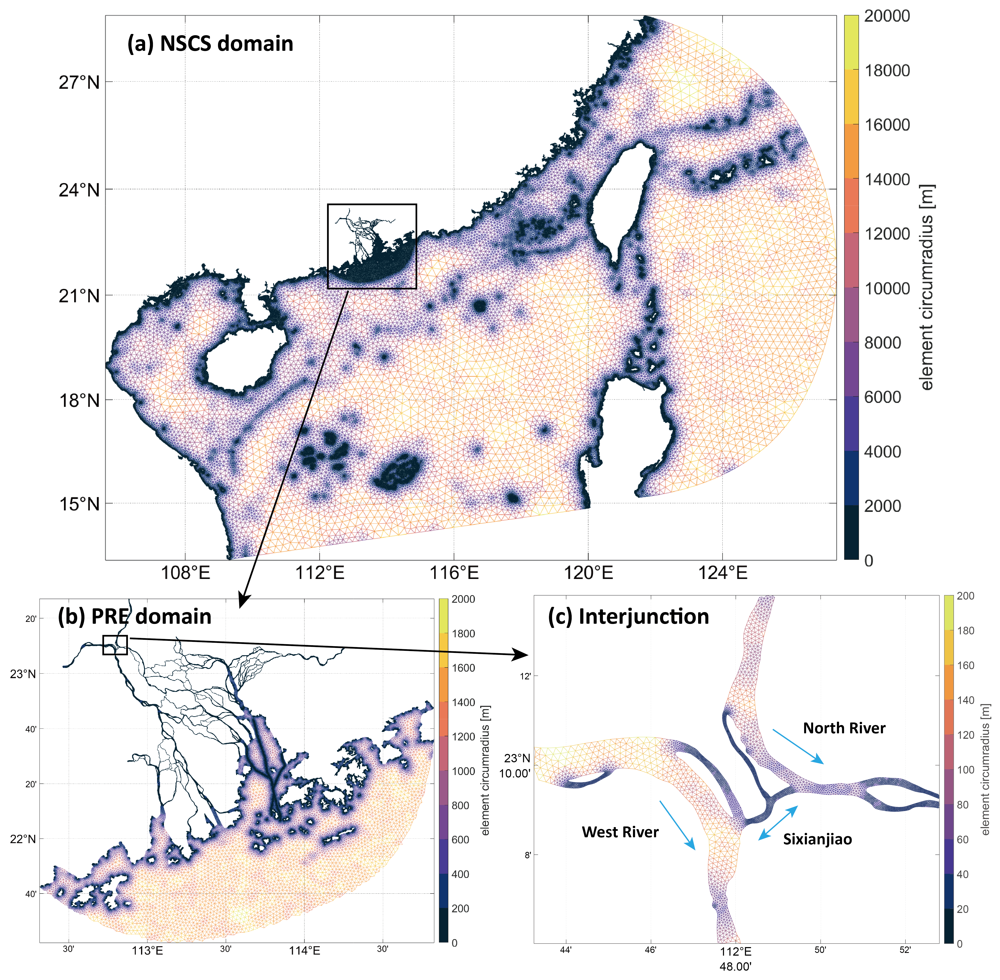

<p align="center">
  <a href="https://github.com/CHLNDDEV/OceanMesh2D"></a>
  <p align="center">Precise distance-based two-dimensional automated mesh generation toolbox intended for coastal ocean/shallow water flow models.</p>
</p>

Table of contents
=================

<!--ts-->
   * [OceanMesh2D](#oceanmesh2d)
   * [Table of contents](#table-of-contents)
   * [Getting help](#getting-help)
   * [Contributing](#contributing)
   * [Code framework](#code-framework)
   * [Starting out](#starting-out)
   * [Testing](#testing)
   * [References](#references)
   * [Gallery](#gallery)
   * [Changelog](#changelog)
<!--te-->

## IMPORTANT NOTE:
This is the default and recommended `PROJECTION` branch. Please use it unless you otherwise require legacy (`MASTER` branch) or the absolute newest features (`DEV` branch).

OceanMesh2D is a set of user-friendly MATLAB functions to generate two-dimensional (2D) unstructured meshes for coastal ocean circulation problems. These meshes are based on a variety of feature driven geometric and bathymetric mesh size functions, which are generated according to user-defined parameters. Mesh generation is achieved through a force-balance algorithm combined with a number of topological improvement strategies aimed at improving the worst case triangle quality. The software embeds the mesh generation process into an object-orientated framework that contains pre- and post-processing workflows, which makes mesh generation flexible, reproducible, and script-able.

Getting help
==============

Besides posting [issues](https://github.com/CHLNDDEV/OceanMesh2D/issues) with the code on Github, you can also ask questions via our Slack channel [here](https://join.slack.com/t/oceanmesh2d/shared_invite/zt-1b96mhvhw-sHUhP2emepHlGtw0~fWmAg).

Note: If the slack link invite isn't working, please send either one of us and an email and we'll fix it. By default, the invite link expires every 30 days.

Otherwise please reach out to either Dr. William Pringle (wpringle@anl.gov) or Dr. Keith Roberts (keithrbt0@gmail.com) with questions or concerns or feel free to start an Issue in the issues tab above.


Contributing
============

All contributions are welcome!

To contribute to the software:

1. [Fork](https://docs.github.com/en/free-pro-team@latest/github/getting-started-with-github/fork-a-repo) the repository.
2. Clone the forked repository, add your contributions and push the changes to your fork.
3. Create a [Pull request](https://github.com/CHLNDDEV/OceanMesh2D/pulls)

Before creating the pull request, make sure that the examples pass...

Some things that will increase the chance that your pull request is accepted:
- Write minimal working [examples](https://en.wikipedia.org/wiki/Minimal_working_example#:~:text=In%20computing%2C%20a%20minimal%20working,to%20be%20demonstrated%20and%20reproduced) that demonstrate the functionality.
- Write good commit and pull request messages.

Code framework
================
`OceanMesh2D`  consists of four standalone classes that are called in sequence. It requires no paid toolboxes to build meshes and has been tested to work with a trial version of MATLAB.

    OceanMesh2D::
    ├── geodata -- process geospatial data.
    ├── edgefx  -- build mesh size functions.
    ├── meshgen -- generate mesh based on mesh size functions and boundaries.
    └── msh     -- store, write, read, inspect, and visualize meshes and their axuillary components for numerical simulation.

Starting Out
============

Clone or download and unzip the current [repository](https://github.com/CHLNDDEV/OceanMesh2D/archive/Projection.zip)

PLEASE READ THE USER GUIDE!
A recent pdf of the user guide is located in this branch. For a continually updated version click [here](https://www.overleaf.com/read/hsqjhvtbkgvj#/54715995/) (wait for compilation and then click download PDF)

Run the "setup.sh" bash script to download the required m_map package and the base datasets:
- GSHHG global shoreline
- SRTM15_PLUS global topobathy DEM

Additional data required for some of the following examples must be downloaded manually from [here](https://drive.google.com/open?id=1LeQJFKaVCM2K59pKO9jDcB02yjTmJPmL). Specifically, Examples 2, 3, 4, 5 and 5b require additional datasets from the google drive folder while base datasets are sufficient for the other examples.
```
Featured in  ┌╼ Examples/Example_1_NZ.m   %<- A simple mesh around South Island New Zealand that uses GSHHS shoreline.
user guide   ├── Examples/Example_2_NY.m   %<- A high-resolution mesh around the New York/Manhattan area that uses a DEM created from LiDAR data.
             └── Examples/Example_3_ECGC.m %<- Builds a mesh for the western North Atlantic with a local high-resolution nest around New York
Featured in         ┌╼ Examples/Example_4_PRVI.m %<- Builds a mesh for the western North Atlantic with three high-resolution nests around Peurto Rico and US Virgin Islands
Geoscientific Model ├── Examples/Example_5_JBAY.m %<- An extremely high-fidelity (15-m) mesh from LiDAR data around Jamaica Bay with CFL-limiting.
Development paper[1]└── Examples/Example_6_GBAY.m %<- An example of the polyline/thalweg mesh size function along the Houston Ship Channel.

```

See [Testing](#testing) to test OceanMesh2D on your system.

Testing
==========

To ensure the software is fully functional on your system before building some crazy meshes it is strongly recommended to run the tests (RunTests.m) in the Tests/ directory.

We test all pull requests using this test suite on a local host before accepting. For substantial pull requests we will also test the Examples from the Examples/ directory.

References!
==============

If you make use of `OceanMesh2D` please include a reference to [1], and to any of [2]-[5] if pertinent ([latex .bib file](https://github.com/CHLNDDEV/OceanMesh2D/tree/Projection/UserGuide/OceanMesh2D_library.bib)). We would also appreciate using our [logo](https://github.com/CHLNDDEV/OceanMesh2D/tree/Projection/imgs) in a presentation featuring `OceanMesh2D`.
```

[1] - Roberts, K. J., Pringle, W. J., and Westerink, J. J., 2019.
      OceanMesh2D 1.0: MATLAB-based software for two-dimensional unstructured mesh generation in coastal ocean modeling,
      Geoscientific Model Development, 12, 1847-1868. https://doi.org/10.5194/gmd-12-1847-2019.
[2] - Roberts, K. J., Pringle, W. J, 2018.
      OceanMesh2D: User guide - Precise distance-based two-dimensional automated mesh generation toolbox intended for coastal
      ocean/shallow water. https://doi.org/10.13140/RG.2.2.21840.61446/2.
[3] - Roberts, Keith J. Unstructured Mesh Generation and Dynamic Load Balancing for Coastal Ocean Hydrodynamic Simulation, 2019.
      PhD Thesis, University of Notre Dame. https://curate.nd.edu/show/4q77fr0022c.
[4] - Roberts, Keith J., Pringle W.J., Westerink J. J. Contreras, M.T., Wirasaet, D., 2019.
      On the automatic and a priori design of unstructured mesh resolution for coastal ocean circulation models,
      Ocean Modelling, 144, 101509. https://doi.org/10.1016/j.ocemod.2019.101509.
[5] - Pringle, W. J., Wirasaet, D., Roberts, K. J., and Westerink, J. J., 2021.
      Global Storm Tide Modeling with ADCIRC v55: Unstructured Mesh Design and Performance,
      Geoscientific Model Development, 14(2), 1125-1145. https://doi.org/10.5194/gmd-14-1125-2021.

```
In addition, best practice when using software in a scientific publication is to cite the permanent doi corresponding to the version used (e.g., for reproducibility). All our releases are archived at the following `Zenodo` repository doi [link](https://doi.org/10.5281/zenodo.1341384).
```
Authors (202X). CHLNDDEV/OceanMesh2D: OceanMesh2D VX.X. Zenodo. https://doi.org/10.5281/zenodo.1341384
```
Please fill in the version (VX.X), author list and year corresponding to the version used.

We would also like to acknowledge various scripts and algorithms from [`mesh2d`](https://github.com/dengwirda/mesh2d) included in OceanMesh2D that have been developed by @dengwirda. Please also see [`JIGSAW-GEO`](https://github.com/dengwirda/jigsaw-geo-matlab):
```
[i] - Engwirda, D., 2017.
      JIGSAW-GEO (1.0): Locally orthogonal staggered unstructured grid generation for general circulation modelling on the sphere.
      Geoscientific Model Development, 10(6), 2117–2140. https://doi.org/10.5194/gmd-10-2117-2017.
```

## `DISCLAIMER: `
The boundary of the meshing domain must be a polygon (first point equals the last and non-self intersecting) but it does not need to be simplified. Read the user guide for more information about the inputs.

GALLERY:
=========
* These images can be made by running the [examples](https://github.com/CHLNDDEV/OceanMesh2D/tree/Projection/Examples)
<p align="center">
   &nbsp &nbsp &nbsp &nbsp
   &nbsp &nbsp &nbsp &nbsp
   &nbsp &nbsp &nbsp &nbsp
   &nbsp &nbsp &nbsp &nbsp
   &nbsp &nbsp &nbsp &nbsp
</p>


* The following images are provided from happy users. Please send us your meshes.

Jiangchao Qiu from his [publication](https://agupubs.onlinelibrary.wiley.com/doi/abs/10.1029/2021EF002638).
<p align="center">
   &nbsp &nbsp &nbsp &nbsp
</p>

Changelog
=========

The format is based on [Keep a Changelog](https://keepachangelog.com/en/1.0.0/)

### Unreleased (on current HEAD of the Projection branch)
## Added
- Option `improve_with_reduced_quality` to `meshgen` for allowing for mesh improvements even when quality is decreasing or large number of nodes eliminated, which sometimes is necessary to force the advancement in mesh quality.
- Option `delaunay_elim_on_exit` to `meshgen` to skip the last call to `delaunay_elim` to potentially avoid deleting boundary elements.
- Geoid offset nodal attribute in `Calc_f13` subroutine. https://github.com/CHLNDDEV/OceanMesh2D/pull/251
- Support for writing Self Attraction and Loading (SAL) files in NetCDF for the ADCIRC model. https://github.com/CHLNDDEV/OceanMesh2D/pull/231
## Changed
- Default mesh improvement strategy is `ds` 2.
- Retrieve boundary indices in `msh.get_boundary_of_mesh` method. https://github.com/CHLNDDEV/OceanMesh2D/pull/259
- `msh.offset63` struct and associated write/make routines for dynamicwaterlevel offset functionality. https://github.com/CHLNDDEV/OceanMesh2D/pull/259
- dynamicWaterLevelCorrection to fort.15 namelist, and PRBCKGRND option to met fort.15 namelist. https://github.com/CHLNDDEV/OceanMesh2D/pull/261
## Fixed
- Recursive cleaning issues: infinite loop and preservation of fixed points.
- `msh.interp` method for `K` argument of length 1, and for the test to determine whether the bathymetry grid is irregular. https://github.com/CHLNDDEV/OceanMesh2D/pull/259
- Printing of namelist character strings or numbers. https://github.com/CHLNDDEV/OceanMesh2D/pull/261
- `Make_offset63.m` time interval computation. https://github.com/CHLNDDEV/OceanMesh2D/pull/261
- Removed dependency on statistics toolbox when using the 'nanfill' option in `msh.interp`. https://github.com/CHLNDDEV/OceanMesh2D/pull/269

### [5.0.0] - 2021-07-29
## Added
- `meshgen.build()` now will rewind the iteration set in the case mesh improvement cannot improve the qualities. https://github.com/CHLNDDEV/OceanMesh2D/pull/234
-  `msh.plot()` now has a `cmap` in which the user can specify their any `cmocean` colormap
- `radius_separated_points` function that trims the points in the mesh to have a specified resolution that can be used before `m_quiver` so that vectors are evenly plotted. https://github.com/CHLNDDEV/OceanMesh2D/pull/225
- Deleting boundary conditions by specifyng their indices in `msh.object.bd` field. See https://github.com/CHLNDDEV/OceanMesh2D/pull/205
- Ability for user to set their own axis limits when plotting with `msh.plot()`. https://github.com/CHLNDDEV/OceanMesh2D/pull/224
## Fixed
- Minor fix to `msh.make_bc` using the `auto` method. https://github.com/CHLNDDEV/OceanMesh2D/pull/237
- correction in setting stereographic projection bounds in `setProj` to make sure points are not pushed outside and become NaNs (was limited to radius of 178 deg but made sure can go up to full 180 deg). https://github.com/CHLNDDEV/OceanMesh2D/pull/225
- Correctly deleting weirs from boundary object through `make_bc` delete method. See https://github.com/CHLNDDEV/OceanMesh2D/pull/205
- Array format fix for reading in ibtype and nvell from fort.14 file and when executing carry_over_weirs. See https://github.com/CHLNDDEV/OceanMesh2D/pull/206
- Fix for irregular grid spacings in DEMs. See https://github.com/CHLNDDEV/OceanMesh2D/pull/204
- tidal constituents for `Make_f15` can now contain "major8" in addition to other constituents in the string/cell array https://github.com/CHLNDDEV/OceanMesh2D/pull/221
- Correctly collect NDBC and NOS stations in mesh when creating `fort15` file using `Make_f15` for meteorological, velocity and elevation records https://github.com/CHLNDDEV/OceanMesh2D/pull/242
## Changed
- `msh.plot()` using type `bd` option now creates a legend for the different boundary condition types. https://github.com/CHLNDDEV/OceanMesh2D/pull/247
- forcing facecolor to white in `m_trimesh` so that it does not intefere with background color option. https://github.com/CHLNDDEV/OceanMesh2D/pull/245
- made topographic elevation bound option for max_ele, wl, slp, and g `edgefx` kwargs consistent and added explanation of this option is included in `edgefx` help. https://github.com/CHLNDDEV/OceanMesh2D/pull/230
- `m_plot()` function calls `m_grid()` with background color input kwarg (if `backcolor` option used) instead of manual application. https://github.com/CHLNDDEV/OceanMesh2D/pull/225
- `tidal_data_to_ob` function called from `Make_f15` populates boundary condition tidal constituents that do not exist in the tidal database with zero values so that user can add user-defined values later (previously did not populate). https://github.com/CHLNDDEV/OceanMesh2D/pull/225
- Improved `cmocean` for pivot handling with discrete colormap. https://github.com/CHLNDDEV/OceanMesh2D/pull/225
- Renamed `Calc_NLCD_Mannings` to `Calc_Mannings_Landcover` and making option for 'ccap' landcover type in addition to 'nlcd' (default) and added the ability to using user specified inteprolation (e.g., nearest, linear, cell-averaging, etc.) of the landcover data to the mesh vertices. https://github.com/CHLNDDEV/OceanMesh2D/pull/221

### [4.0.0] - 2021-03-14
## Added
- `mesh2d` interface improvements to filter small polygons.
- Support for creation of `fort.20` files for forcing rivers by @Jiangchao3
- Mesh "cleaning" modes moderate and aggressive transfer nodal attributes via improvements to `msh.map_mesh_properties`
- `msh.remove_attribute()` method to remove f13 attribute(s)
- new `msh.interp()` `slope_calc` kwarg option to set the method of computing the topographic gradients (slopes), either `rms` [default] or `abs`
- new `extract_subdomain()` `keep_numbering` kwarg option to keep the full mesh triangulation numbering on the subdomain [off by default].

## Changed
- `msh.plot()` overhaul. All options specified via kwarg.
- `msh.plot()` option `subset` option is now called `subdomain`
- `msh.plot()` arbitary f13 option now utilizes `colormap` kwarg
- `utilities/extract_subdomain` now is called with kwargs.
- Cleaning up `msh.bound_courant_number()` to use `msh.get_boundary_of_mesh()` for Delaunay-triangulation and allowing `msh.clean()` to do the transfer of attributes automatically.
- `msh.plus(obj1,obj2)` can now carry over obj2 f13 attributes if also exist in obj1
- `msh()` more efficient storing of boundary conditions read in from fort.xx files, and `msh.write()` can write out arbitrary vertex indices (instead of just 1 to NP).

## Fixed
- Boundary labeling fix
- Prompt when labeling bcs using `outer` kwarg in `make_bc`
- fix for boundary condition mapping in `msh.map_mesh_properties()` especially for weirs/barriers
- fix for barrier mapping in `msh.plus()` routine
- fix for `msh.make_bc(m,auto,gdat)` where gdat is empty. In this case it uses the depths on the mesh to determine the open boundaries.
- check for `poly2ccw` mapping toolbox function in `kml2struct`
- fix for `msh.plot()` on log colormap when plotting f13 attributes
## Deleted
- Deprecating `msh.CheckTimestep()` for `msh.bound_courant_number`. Added error message and instruction in the CheckTimestep help

### [3.3.0] - 2020-12-21
## Fixed
- Users without mapping toolbox could not read in shapefiles because of a bug that
  made them required to have a 3d shapefiles.
- plotting `gdat` with no shoreline.
- plotting a mesh's bathymetry with a non-zero datum using cmocean.
- cell-averaging interpolation method in msh.interp fixed for unequal lon-lat DEM grid spacings

## Added
- Mesh patch smoother
- Ability to remesh abritary patches of elements within the domain while respecting user-defined mesh sizes and the patches boundaries.
- Ability to use the TPXO9 Atlas for the tidal bcs and sponge (inside tidal_data_to_ob.m and Calc_Sponge.m) by using '**' wildcards in place of the constituent name within the tidal atlas filename (the atlas has an individual file for each constituent).
- Introducing 'auto_outer' option for the make_bc msh method which populates the bc for the outermost mesh boundary polygon (ignores islands)
- Changelog to README
- "mapMeshProperties" msh method ports over mesh properties for a mesh subset
- 'invert' option in the msh.interp method to turn off the DEM value inversion typically performed

## Changed
- for the make_bc msh method 'auto'/'auto_outer' options, allowing for the 'depth' method of classification to use the interpolated depths on the mesh if gdat is empty.
- improving help for make_bc msh method, Make_f15.m and Calc_Sponge.m
- renamed "ExtractSubDomain.m" to "extract_subdomain.m"
- improving "extract_subdomain.m" help and facilitating NaN-delimited polygons
- ability to return boundary as a cell in "get_boundary_of_mesh" msh method
- "Example_1_NZ.m" includes example of plotting bcs of a msh subset
- using "mapMeshproperties" method in "fixmeshandcarry"
- using "fixmeshandcarry" in the "cat" msh method
- improving warning and error messages for the "interp" msh method
- adding geofactor into "writefort15" for the GAHM vortex model
