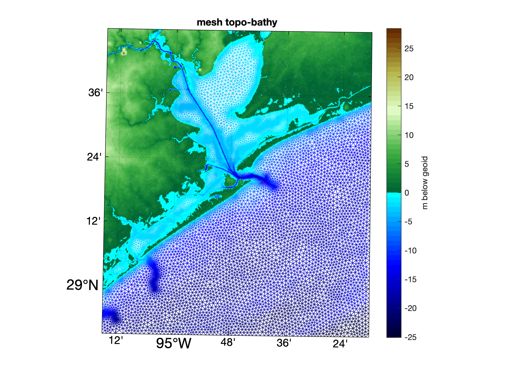
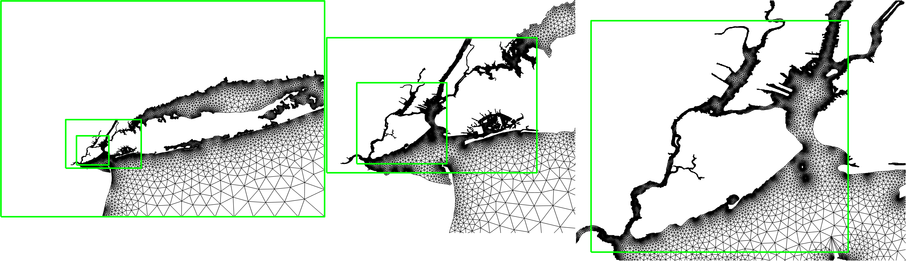
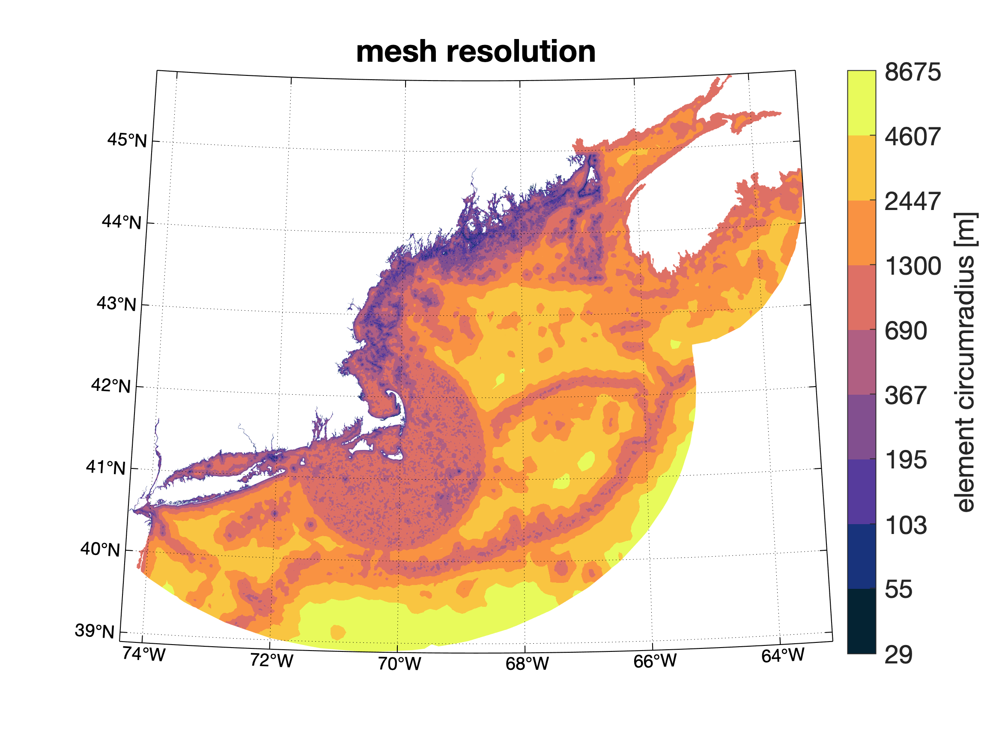
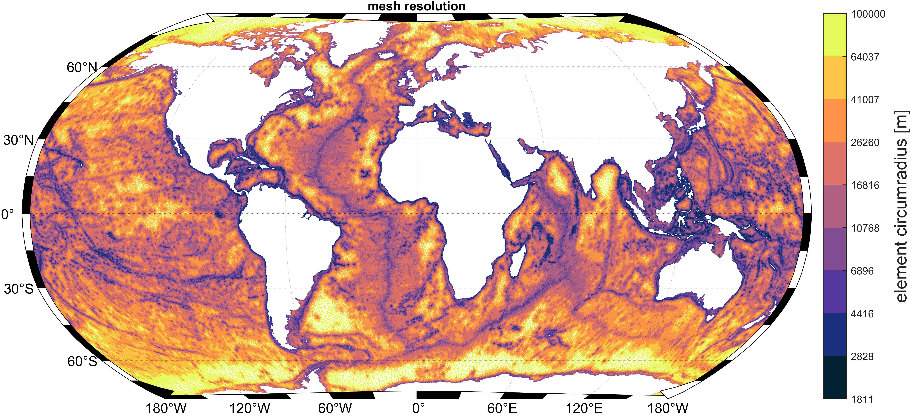

# `OceanMesh2D:`
## `Precise distance-based two-dimensional automated mesh generation toolbox intended for coast ocean/shallow water flow models`

## IMPORTANT NOTE:
This is the default and recommended `PROJECTION` branch. Please use it unless you otherwise require legacy (`MASTER` branch) or the absolute newest features (`DEV` branch). 

## `DISCLAIMER: `
The boundary of the meshing domain must be a polygon (first point equals the last and non-self intersecting) but it does not need to be simplified. Read the user guide for more information about the inputs.

<p align="center">
   &nbsp &nbsp &nbsp &nbsp
   &nbsp &nbsp &nbsp &nbsp
   &nbsp &nbsp &nbsp &nbsp
   &nbsp &nbsp &nbsp &nbsp
</p>
OceanMesh2D is a set of user-friendly MATLAB functions to generate two-dimensional (2D) unstructured meshes for coastal ocean circulation problems. These meshes are based on a variety of feature driven geometric and bathymetric mesh size functions, which are generated according to user-defined parameters. Mesh generation is achieved through a force-balance algorithm combined with a number of topological improvement strategies aimed at improving the worst case triangle quality. The software embeds the mesh generation process into an object-orientated framework that contains pre- and post-processing workflows, which makes mesh generation flexible, reproducible, and script-able. 

## `Code framework` 
`OceanMesh2D`  consists of four standalone classes that are called in sequence. It requires no paid toolboxes to build meshes and has been tested to work with a trial version of MATLAB.

    OceanMesh2D::
    ├── geodata -- process geospatial data.
    ├── edgefx  -- build mesh size functions.
    ├── meshgen -- generate mesh based on mesh size functions and boundaries.
    └── msh     -- store, write, read, inspect, and visualize meshes and their axuillary components for numerical simulation.

## `Starting Out`

Clone or download and unzip the current [repository](https://github.com/CHLNDDEV/OceanMesh2D/archive/Projection.zip)

PLEASE READ THE USER GUIDE!
A recent pdf of the user guide is located in this branch. For a continually updated version click [here](https://www.overleaf.com/read/hsqjhvtbkgvj#/54715995/) (wait for compilation and then click download PDF)

Download the data for the following examples [here](https://drive.google.com/open?id=1LeQJFKaVCM2K59pKO9jDcB02yjTmJPmL)
 
in addition to [here](http://www.soest.hawaii.edu/pwessel/gshhg/gshhg-shp-2.3.7.zip) for the GSHHG ESRI shapefile and here: "ftp://topex.ucsd.edu/pub/srtm15_plus/SRTM15+V2.nc" for the latest SRTM15_PLUS global topobathy DEM.
```
Featured in  ┌╼ Example_1_NZ.m   %<- A simple mesh around South Island New Zealand that uses GSHHS shoreline. 
user guide   ├── Example_2_NY.m   %<- A high-resolution mesh around the New York/Manhattan area that uses a DEM created from LiDAR data.  
             └── Example_3_ECGC.m %<- Builds a mesh for the western North Atlantic with a local high-resolution nest around New York
Featured in         ┌╼ Example_4_PRVI.m %<- Builds a mesh for the western North Atlantic with three high-resolution nests around Peurto Rico and US Virgin Islands
Geoscientific Model ├── Example_5_JBAY.m %<- An extremely high-fidelity (15-m) mesh from LiDAR data around Jamaica Bay with CFL-limiting.
Development paper[1]└── Example_6_GBAY.m %<- An example of the polyline/thalweg mesh size function along the Houston Ship Channel. 

```

## `References!`

If you make use of `OceanMesh2D` please include a reference to the following:
```

[1] - Roberts, K. J., Pringle, W. J., and Westerink, J. J., 2019. 
      OceanMesh2D 1.0: MATLAB-based software for two-dimensional unstructured mesh generation in coastal ocean modeling, 
      Geoscientific Model Development, 12, 1847-1868. https://doi.org/10.5194/gmd-12-1847-2019.
[2] - Roberts, K. J., Pringle, W. J, 2018. 
      OceanMesh2D: User guide - Precise distance-based two-dimensional automated mesh generation toolbox intended for coastal
      ocean/shallow water. https://doi.org/10.13140/RG.2.2.21840.61446/2.       

```
